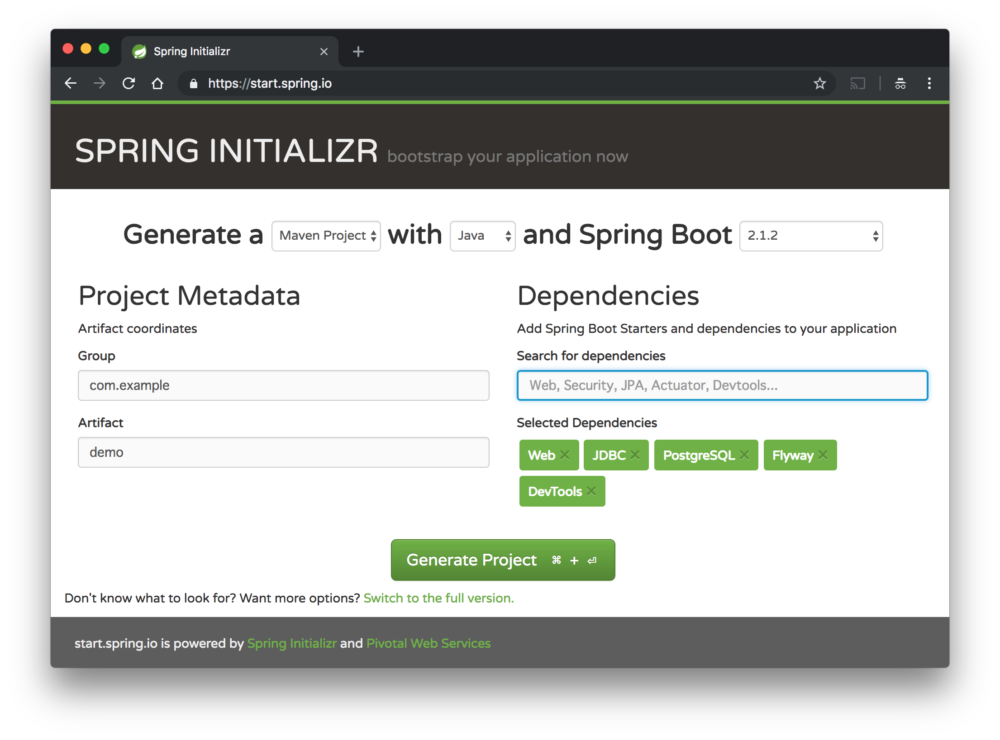

# Spring Boot/Doma/PostgreSQL

## プロジェクトの構築

Spring Initializrを使う。



`pom.xml`へDomaとdoma-spring-bootを追加する。

```diff
diff --git a/pom.xml b/pom.xml
index 6d0f680..03ff8a4 100644
--- a/pom.xml
+++ b/pom.xml
@@ -16,9 +16,21 @@
 
 	<properties>
 		<java.version>1.8</java.version>
+		<doma-spring-boot.version>1.1.1</doma-spring-boot.version>
+		<doma.version>2.22.0</doma.version>
 	</properties>
 
 	<dependencies>
+		<dependency>
+			<groupId>org.seasar.doma.boot</groupId>
+			<artifactId>doma-spring-boot-starter</artifactId>
+			<version>${doma-spring-boot.version}</version>
+		</dependency>
+		<dependency>
+			<groupId>org.seasar.doma</groupId>
+			<artifactId>doma</artifactId>
+			<version>${doma.version}</version>
+		</dependency>
 		<dependency>
 			<groupId>org.springframework.boot</groupId>
 			<artifactId>spring-boot-starter-jdbc</artifactId>
```

## 起動方法

起動コマンド。

```
docker run -d -p 5432:5432 -e POSTGRES_USER=demo --name demo-db postgres
```

データをクリアしたやり直したい場合は`docker stop demo-db && docker rm demo-db`または`docker rm -f demo-db`する。

`docker rm`してもデータを残したい場合は次のコマンド。

```
docker run -d -p 5432:5432 -e POSTGRES_USER=demo -v demo-data:/var/lib/postgresql/data --name demo-db postgres
```

アプリケーションはMaven（`./mvnw spring-boot:run`）か`java -jar`で実行できる。

"Hello, world!"をするだけのエンドポイントを用意しているので次の`curl`コマンドで動作確認ができる。

```
curl localhost:8080/demo
```
